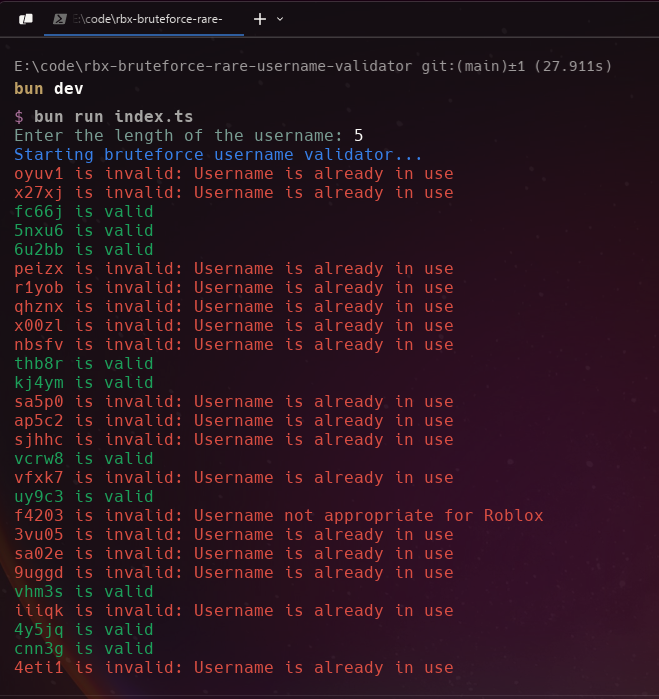

# rbx-bruteforce-rare-username-validator

A tool for automatically checking the availability of Roblox usernames by generating random combinations and validating them against Roblox's username validation API.

## Preview
<div align="center">
    
</div>

## Features

- 🔄 Random username generation with customizable length
- ✅ Validates usernames against Roblox's official API
- 📝 Saves results in CSV format (valid.csv and invalid.csv)
- 🔍 Duplicate checking to avoid reprocessing the same usernames
- ⏱️ Built-in rate limiting to prevent API blocks
- 🛡️ Comprehensive error handling and retry mechanisms

## Installation

```bash
bun install
```

## Usage

1. Run the program:
```bash
bun run index.ts
```

2. Enter the desired username length when prompted

3. The program will automatically:
   - Generate random usernames
   - Check their availability
   - Save results to CSV files in the `output` directory

## Output Files

- `output/valid.csv`: Contains available usernames
- `output/invalid.csv`: Contains taken or invalid usernames

## Technical Details

- Built with TypeScript and Bun runtime
- Uses axios for HTTP requests
- Implements chalk for colorful console output
- Uses Node.js fs module for file operations

## Requirements

- Bun runtime (v1.2.5 or higher)
- Node.js compatible system

## Note

This tool is for educational purposes only. Please use responsibly and in accordance with Roblox's terms of service.
